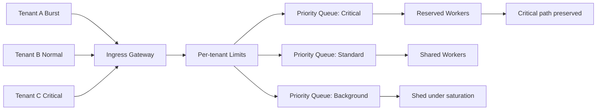

# Multitenant Overload Control

**Summary:** Diagram and interpretation for multitenant overload control.

## Interpretation
This diagram highlights overload decision points and containment boundaries.

## Related concepts
- [Overload Control Model](../overview/overload-control-model.md)

## Related reading on myrobertson.com
- [Distributed Systems Writing Hub](https://www.myrobertson.com/blog/)
- [Backpressure in Distributed Systems: Stability, Correctness, and Graceful Degradation](https://www.myrobertson.com/blog/backpressure-stability-correctness-distributed-systems)
- [API Backpressure Explained Simply](https://www.myrobertson.com/blog/api-backpressure-explained-simply)
- [What Is a Control Plane?](https://www.myrobertson.com/blog/what-is-a-control-plane)
- [Architecting a Multitenant Control Plane for a Next-Generation Data Tier](https://www.myrobertson.com/blog/architecting-a-multitenant-control-plane-for-a-next-generation-data-tier)
- [Distributed Systems Case Studies](https://www.myrobertson.com/case-studies/)
