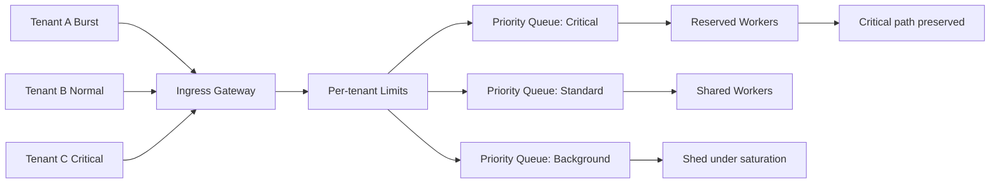

# Multitenant Overload Control

**Summary:** Diagram and interpretation for multitenant overload control.

## Interpretation
This diagram highlights overload decision points and containment boundaries.

## Related concepts
- [Overload Control Model](../overview/overload-control-model.md)
